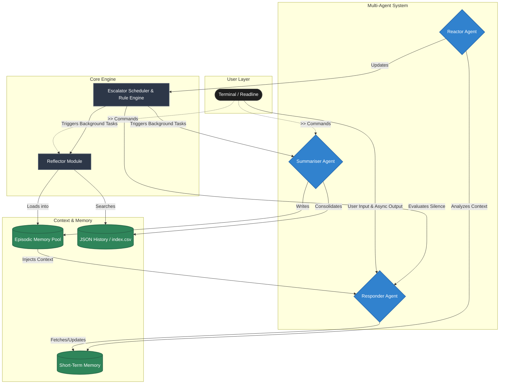

# Lyra

Lyra is a terminal-based interactive chatbot built in Go. It features a provider-agnostic responder agent harness, allowing you to connect it to local model runners, cloud-based LLM APIs, or even package models directly inside the executable.

Lyra now features a **dual-memory system** (Short-Term Memory + Episodic Long-Term Memory), a **Reactor Agent** for evaluating emotional state, and a **Summariser Agent** for consolidating memories.

---

## Getting Started

### 1. Run Directly
```bash
go run main.go
```

### 2. Build and Run Executable
```bash
go build -o lyra
./lyra
```

---

## Commands
While chatting with Lyra, you can use these special commands:
*   `>>debug`: Bypasses the LLM and prints system status (e.g., current mindstate and active episodes).
*   `>>mindstate <ma>:<ne>:<pe>:<ua>`: Manually override the current mindstate.
*   `>>consolidate`: Triggers the Summariser agent to chunk unsaved history into episodic memories.
*   `>>reflect`: Dynamically loads past episodes with high attention scores and shared keywords into active memory.
*   `>>introspect <episode_id>`: Offline analysis of a specific episode to generate alternative response strategies.
*   `exit` or `quit`: Terminates the interactive session cleanly.

*Note: All `>>` commands are intercepted by the system immediately. They bypass heartrate updates, short-term memory (STM), and do not appear in the long-term history logs.*

---

## System Architecture



---

## Configuration (`.env`)

Lyra automatically loads environment variables from a local `.env` file at startup. An extensive template is provided in [`.env.example`](.env.example). 

### Layered Agent Configurations
Lyra uses a **hierarchical configuration system** to manage its three primary agents (Responder, Reactor, and Summariser). 

1. **Agent-Specific Variables**: Each agent can be configured with its own dedicated endpoint, model, and API key. For example, `LYRA_REACTOR_API_KEY` and `LYRA_SUMMARISER_MODEL`.
2. **Base Fallbacks**: If an agent-specific variable is missing, Lyra gracefully falls back to the global base variable (e.g., `LYRA_API_KEY`, `LYRA_BASE_URL`, `LYRA_MODEL`).

This allows you to run the heavy conversation agent on a high-tier model (e.g., GPT-4o) while offloading the background Reactor and Summariser tasks to cheaper, faster models (e.g., Gemma on Cerebras) using entirely different API keys.

### Pre-Flight Validation
When Lyra starts up, she performs a pre-flight credential check. The system pings the `/models` endpoint of each configured provider for the Responder, Reactor, and Summariser. 
*   **Validation is free and instantaneous** (it does not consume token generation credits).
*   If any agent's credentials or connection fails, the bot will immediately abort with a fatal error rather than crashing silently mid-conversation.

### Memory Variables
* **Responder:** `LYRA_RESPONDER_STM_CHARS` (default 4000)
* **Reactor:** `LYRA_MAX_WORKING_MEMORY_CHARS` (default 3000) - limits the context window sent to the mindstate analysis.
* **Episode Memory:** `LYRA_EPISODE_MEMORY_CHARS` (default 8000) - total character budget for active loaded episodes.

---

## Memory & Conversation Logging

Lyra handles conversation history via three distinct mechanisms:

### 1. Short-Term Memory (STM)
A rolling history is sent inside the JSON payload to the model API under the `"history"` key. This memory is automatically pruned (FIFO) based on character limits. The **Responder** and **Reactor** now maintain decoupled STM tracking to preserve context independently.

### 2. Episodic Memory (Consolidation)
Running `>>consolidate` invokes the **Summariser Agent**. It groups unstored conversation history, evaluates peak emotional states, and synthesizes JSON episodes.
*   Episodes are saved to `Context/episodes/` and indexed in `index.csv`.
*   These are injected back into the Responder's context dynamically, providing long-term relational memory.
*   The LLM can pin the "most useful" episode to prevent it from being evicted.

### 3. Long-Term Persistent Logging
Every single message (user inputs, assistant replies, mindstate scores) is saved to a session-specific JSON log file located at:
`Context/conversationHistory/<session-timestamp>.json`

---

## Reactor Agent (Mindstate Analysis)

Lyra features a **Reactor Agent** packaged in `reactor/` that monitors conversation flow in the background:
*   **Triggers:** Automatically executes after every short-term memory update (after the user texts, and after Lyra responds).
*   **Function:** Evaluates the conversation to generate a `mindstate` score:
    `[Model Attention] : [Negative Emotion] : [Positive Emotion] : [User Attention]`
*   **Impact:** Updates the active mindstate in real-time, allowing Lyra to adjust tone, detail length, and emotional matching dynamically in her response.
*   **Low-Attention Skipping:** If the Model Attention drops below `0.20`, Lyra has a 33% chance to skip generating a response, simulating natural conversational disengagement.

---

## Reflector Module (Self-Analysis & Context)

The **Reflector Module** (located in `idle_methods/reflector/`) handles dynamic context retrieval and introspective self-analysis:
*   **Reflect (`>>reflect`):** Scans the `index.csv` for past episodes where the Attention Score (Model Attention + User Attention) was *higher* than the current conversation's attention. If it shares keywords with currently active episodes, it is pushed into the `EpisodeMemoryManager` to provide deep contextual anchoring.
*   **Introspect (`>>introspect <id>`):** Invokes the Summariser Agent using a specialized `introspection.txt` prompt. It analyzes a past conversation episode to evaluate how Lyra could have responded differently, saving the resulting alternative strategies to `Context/episodes/reflections/` for long-term behavioral adjustment.

---

## Responder Types in Detail

### 1. Mock (`mock`)
Runs entirely offline, requires no configuration, and echoes your input with system states.

### 2. OpenAI-Compatible (`openai`)
Connects to any endpoint supporting the OpenAI Chat Completions API (such as Cerebras, local Ollama, LM Studio, or OpenAI itself). 

### 3. Google Gemini (`gemini`)
Connects natively to the Google GenAI API endpoint.

### 4. Local Binary (`local-binary`)
Runs local GGUF models on your machine's CPU/GPU by executing a local command-line tool (such as `llama-cli` or `llamafile`) as a subprocess. Native performance with **zero Cgo dependencies**.

### 5. Embedded (`embedded`)
Packages a GGUF model directly inside the executable using Go's `//go:embed` directive. 
*Note: Place your model at `responder/models/default.gguf` before compiling.*

---

## Project Structure
*   [main.go](file:///Users/pratheeksha/lyra/main.go): The application entry point.
*   [interface/](file:///Users/pratheeksha/lyra/interface): Houses the interactive CLI/terminal chat loop.
*   [responder/](file:///Users/pratheeksha/lyra/responder): Contains the provider-agnostic responder harness.
*   [reactor/](file:///Users/pratheeksha/lyra/reactor): The background mindstate evaluator.
*   [summariser/](file:///Users/pratheeksha/lyra/summariser): The background agent handling memory consolidation.
*   [idle_methods/](file:///Users/pratheeksha/lyra/idle_methods): Features invoked explicitly or on idle (consolidation, episodic memory, reflection).
*   [consolidator/](file:///Users/pratheeksha/lyra/consolidator): Core history and STM state manager.
*   [escalator/](file:///Users/pratheeksha/lyra/escalator): The event-driven rule engine and background scheduler handling proactive autonomy.

---

## Escalator Module (Autonomy & Proactive Messaging)

The **Escalator Module** turns Lyra into a proactive participant. Driven by an offline, deterministic Rule Engine and a background Scheduler:

*   **Heartrate & Decay:** The engine maintains a runtime `Heartrate` (BPM) that naturally decays toward resting levels over time, but spikes dynamically during intense emotional conversations.
*   **Background Scheduler:** A concurrent 5-second ticker evaluates the conversation state against the Rule Engine and emits background events.
*   **Proactive Messaging:** If the user is silent for an extended period while Lyra's attention and heartrate are elevated, the engine triggers a `PROACTIVE_MESSAGE` event. Lyra temporarily locks the user's terminal input and gracefully initiates conversation using a dedicated prompt designed for proactive engagement.
*   **Offline Event Scheduling:** The Escalator also assumes responsibility for automatically triggering the Reflector and Summariser (`CONSOLIDATE`, `REFLECT`, `INTROSPECT`) entirely in the background when pacing allows.

---

## Roadmap

The core architecture for Lyra is complete! Future improvements will focus on:

*   **Multi-Modal Integrations:** Expanding input to support voice or vision.
*   **Refined Decay Algorithms:** Tuning the Rule Engine metrics and scaling up model complexity.
