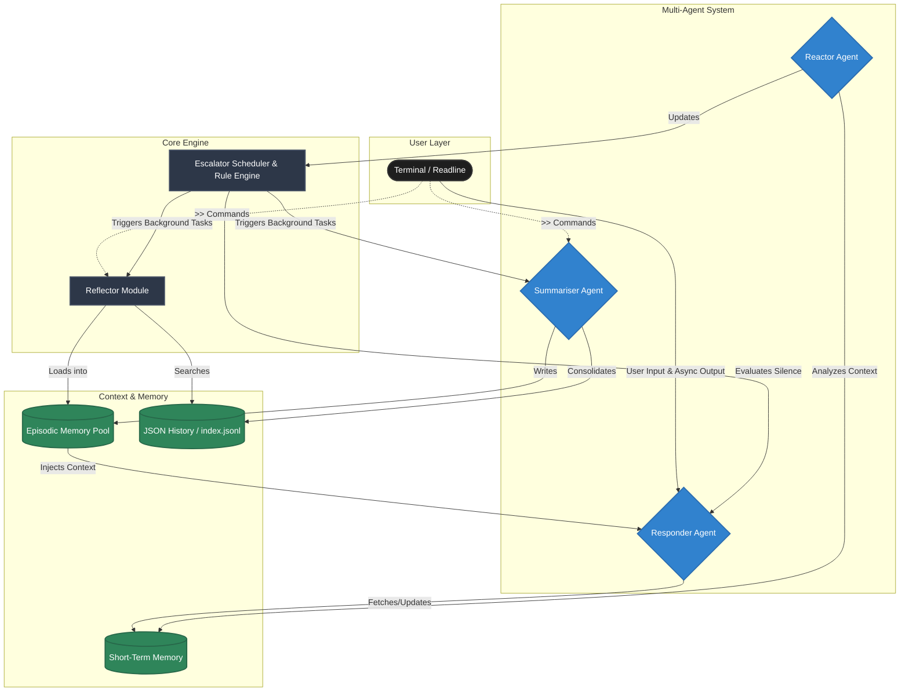

# MSRPEngine

MSRPEngine (Mind-State Roleplay Engine) is a terminal-based interactive chatbot framework built in Go. It features a provider-agnostic responder agent harness, allowing you to connect it to local model runners, cloud-based LLM APIs, or even package models directly inside the executable.

MSRPEngine features a **dual-memory system** (Short-Term Memory + Episodic Long-Term Memory), a **Reactor Agent** for evaluating emotional state, and a **Summariser Agent** for consolidating memories.

---

## Getting Started

### 1. How to Run a Sample Binary (Quickstart)
We provide pre-compiled bots in the `samples/` folder for demonstration purposes. These are ready to run instantly!

1. Navigate to one of the sample folders (e.g., `cd terminal-app/samples/lyra`).
2. Open the `.env` file and configure your API keys (e.g. `SYSTEM_RESPONDER_API_KEY`).
3. Run the binary! (e.g., double click `lyra` or run `./lyra` in the terminal).

*Because the binary automatically resolves its own path, it will instantly find the `.env` file next to it, and it will spawn its own isolated `Context/` folder for memory storage exactly where it was launched!*

### 2. How to Build Your Own Binary
If you want to create a brand new bot with a custom personality, you compile it from the source code.

1. Open `terminal-app/src/prompts/personality.txt` and write the core prompt/identity for your new bot.
2. Open a terminal and run the build script, providing the name of the binary you want to create:
   ```bash
   cd terminal-app
   ./build.sh my_custom_bot
   ```
3. Your compiled binary will be waiting for you in the `build/` folder!
4. You can now package this binary with its `.bin/` sidecar folder and an `.env` file to share it with others.

## Commands
While chatting with your Persona, you can use these special commands:
*   `>>debug`: Bypasses the LLM and prints system status (e.g., current mindstate and active episodes).
*   `>>mindstate <ma>:<ne>:<pe>:<ua>`: Manually override the current mindstate.
*   `>>consolidate`: Triggers the Summariser agent to chunk unsaved history into episodic memories.
*   `>>reflect`: Dynamically loads past conversational facts and behavioral strategies into active memory using semantic vector search.
*   `>>introspect`: Offline analysis of recent high-emotion conversations to generate alternative response strategies and behavioral facts.
*   `>>exit`: Terminates the interactive session cleanly and saves your session to the CSV ledger.

*Note: All `>>` commands are intercepted by the system immediately. They bypass heartrate updates, short-term memory (STM), and do not appear in the long-term history logs.*

---

## System Architecture



---

## Configuration (`.env`)

The engine automatically loads environment variables from a local `.env` file at startup. An extensive template is provided in [`.env.example`](.env.example). 

### Layered Agent Configurations
The engine uses a **hierarchical configuration system** to manage its three primary agents (Responder, Reactor, and Summariser). 

1. **Agent-Specific Variables**: Each agent can be configured with its own dedicated endpoint, model, and API key. For example, `SYSTEM_REACTOR_API_KEY` and `SYSTEM_SUMMARISER_MODEL`.
2. **Base Fallbacks**: If an agent-specific variable is missing, the engine gracefully falls back to the global base variable (e.g., `SYSTEM_API_KEY`, `SYSTEM_BASE_URL`, `SYSTEM_MODEL`).

This allows you to run the heavy conversation agent on a high-tier model (e.g., GPT-4o) while offloading the background Reactor and Summariser tasks to cheaper, faster models (e.g., Gemma on Cerebras) using entirely different API keys.

### Pre-Flight Validation
When the engine starts up, it performs a pre-flight credential check. The system pings the `/models` endpoint of each configured provider for the Responder, Reactor, and Summariser. 
*   **Validation is free and instantaneous** (it does not consume token generation credits).
*   If any agent's credentials or connection fails, the bot will immediately abort with a fatal error rather than crashing silently mid-conversation.

### Memory Variables
* **Responder:** `SYSTEM_RESPONDER_STM_CHARS` (default 4000)
* **Reactor:** `SYSTEM_MAX_WORKING_MEMORY_CHARS` (default 3000) - limits the context window sent to the mindstate analysis.
* **Episode Memory:** `SYSTEM_EPISODE_MEMORY_CHARS` (default 8000) - total character budget for active loaded episodes.

---

## Memory & Conversation Logging

The engine handles conversation history via three distinct mechanisms:

### 1. Short-Term Memory (STM)
A rolling history is sent inside the JSON payload to the model API under the `"history"` key. This memory is automatically pruned (FIFO) based on character limits. The **Responder** and **Reactor** now maintain decoupled STM tracking to preserve context independently.

### 2. Episodic Memory (Consolidation)
Running `>>consolidate` invokes the **Summariser Agent**. It groups unstored conversation history, evaluates peak emotional states, and synthesizes discrete facts.
*   Facts are saved directly to a `chromem-go` vector database instead of loose JSON files.
*   These facts are injected back into the Responder's context dynamically, providing long-term relational memory.

### 3. Long-Term Persistent Logging
Every single message (user inputs, assistant replies, mindstate scores) is saved to a session-specific JSON log file located at:
`Context/conversationHistory/<session-timestamp>.json`

---

## Reactor Agent (Mindstate Analysis)

The framework features a **Reactor Agent** packaged in `reactor/` that monitors conversation flow in the background:
*   **Triggers:** Automatically executes after every short-term memory update (after the user texts, and after the Persona responds).
*   **Function:** Evaluates the conversation to generate a `mindstate` score:
    `[Model Attention] : [Negative Emotion] : [Positive Emotion] : [User Attention]`
*   **Impact:** Updates the active mindstate in real-time, allowing the Persona to adjust tone, detail length, and emotional matching dynamically in its response.
*   **Low-Attention Skipping:** If the Model Attention drops below `0.20`, the Persona has a 33% chance to skip generating a response, simulating natural conversational disengagement.

---

## Reflector Module (Self-Analysis & Context)

The **Reflector Module** (located in `idle_methods/reflector/`) handles dynamic context retrieval and introspective self-analysis using **offline semantic vector embeddings**:
*   **Reflect (`>>reflect`):** Scans the `chromem-go` database for facts that are semantically relevant to the current conversation context, pushing them into active memory. It utilizes a local Cosine Similarity search via its background `ollama` sidecar engine.
*   **Introspect (`>>introspect`):** Invokes the Summariser Agent using a specialized `introspection.txt` prompt. It scans the history for high Negative Emotion interactions that match the current context, and evaluates how the Persona could have responded differently. It generates a **Behavioral Strategy fact** and saves it to the `chromem-go` database for long-term behavioral adjustment.

**Remote Embedding Configuration:**
By default, the engine boots a local Ollama sidecar for zero-dependency embeddings. To save resources or run entirely serverless, you can route embedding generation to a remote provider (like Cohere or your own API) by setting these environment variables:
```env
EMBEDDING_API_URL=https://api.cohere.com/v1/embed
EMBEDDING_MODEL=embed-english-v3.0
EMBEDDING_API_KEY=your_cohere_key_here
```
If `EMBEDDING_API_URL` is detected, the engine will safely skip booting the local sidecar.

---

## Responder Types in Detail

### 1. Mock (`mock`)
Runs entirely offline, requires no configuration, and echoes your input with system states.

### 2. OpenAI-Compatible (`openai`)
Connects to any endpoint supporting the OpenAI Chat Completions API (such as Cerebras, local Ollama, LM Studio, or OpenAI itself). 

### 3. Google Gemini (`gemini`)
Connects natively to the Google GenAI API endpoint.

### 4. Local Binary (`local-binary`)
Runs local GGUF models on your machine's CPU/GPU by executing a local command-line tool (such as `llama-cli` or `llamafile`) as a subprocess. Native performance with **zero Cgo dependencies**.

### 5. Embedded (`embedded`)
Packages a GGUF model directly inside the executable using Go's `//go:embed` directive. 
*Note: Place your model at `responder/models/default.gguf` before compiling.*

---

## Project Structure
*   [`main.go`](./main.go): The application entry point.
*   [`interface/`](./src/interface): Houses the interactive CLI/terminal chat loop.
*   [`responder/`](./src/responder): Contains the provider-agnostic responder harness.
*   [`reactor/`](./src/reactor): The background mindstate evaluator.
*   [`summariser/`](./src/summariser): The background agent handling memory consolidation.
*   [`idle_methods/`](./src/idle_methods): Features invoked explicitly or on idle (consolidation, episodic memory, reflection).
*   [`consolidator/`](./src/consolidator): Core history and STM state manager.
*   [`escalator/`](./src/escalator): The event-driven rule engine and background scheduler handling proactive autonomy.

---

## Escalator Module (Autonomy & Proactive Messaging)

The **Escalator Module** turns the Persona into a proactive participant. Driven by a deterministic Rule Engine and a background Scheduler:

*   **Customizable Rules (`default_ruleengine.yaml`)**: The Rule Engine uses `expr` to evaluate rules dynamically. It is embedded into the binary at build time. You can modify this YAML file before building to define exact logic for heart rate spikes and background events.
*   **Properties & Variables**: The Rule Engine evaluates rules against a live `Env` struct containing:
    *   `Heartrate` (float): Tracks cognitive load and excitement. Natural resting rate is 70 BPM. Spikes during high-attention or emotional exchanges.
    *   `MentalEnergy` (float): Ranges from 0–100. Doing heavy tasks (responding, reflecting) costs energy. It naturally regenerates during idle time when the Heartrate returns to resting levels.
    *   `EnergyFactor` (float): `MentalEnergy / 100`, used to scale heartrate spikes (a tired bot gets less excited).
    *   `IdleDurationMins` & `IdleDurationSecs`: Time since the user last sent a message.
    *   `ModelAttention`, `UserAttention`, `PositiveEmotion`, `NegativeEmotion`: The latest mindstate values parsed directly from the Reactor module.
*   **Background Scheduler**: A concurrent ticker evaluates the state against the Rule Engine and emits events (e.g., `PROACTIVE_MESSAGE`, `REFLECT`, `CONSOLIDATE`, `INTROSPECT`).
*   **Environment Modifiers**: The engine respects variables that tweak background rules:
    *   `SYSTEM_CONSOLIDATION_FREQ_MINS` (default: 1): How often unstored messages are grouped into an episode.
    *   `SYSTEM_TEMP_SLEEP_CYCLE_MINS` (default: 60): How often the bot introspects during "Temp Sleep" (when the user has been away for > 5 mins).
*   **Proactive Messaging**: If the user is silent while the bot has high energy, high attention, and high heartrate, it triggers a proactive text message.

---

## Roadmap

The core architecture for MSRPEngine is complete! Future improvements will focus on:

*   **Multi-Modal Integrations:** Expanding input to support voice or vision.
*   **Refined Decay Algorithms:** Tuning the Rule Engine metrics and scaling up model complexity.
